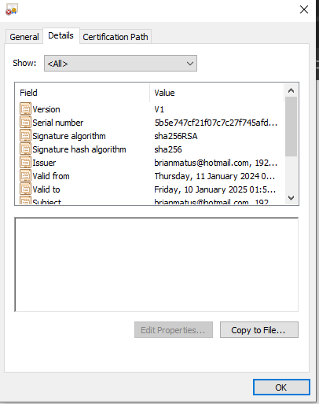

# Saltar pop-up de confirmación de ejecución

## Pasos
Se recomienda realizarlos las siguientes acciones en /root/certs
```
mkdir -p root/certs
cd ~/certs
```
1. Agregamos **extra-prompt/allow_prompt.reg** al registro. Este habilita una opción en *Google Chrome* que permite recordar elección de protocolos abiertos
2. Si ~/.rnd no existe, generarlo
   
   ```# openssl rand -writerand ~/.rnd```

3. Crear llave privada (cualquier passphrase)
   
   ```sudo openssl genpkey -algorithm RSA -out server_k.key -aes256 -pkeyopt rsa_keygen_bits:4096```

4. Remover passphrase de la llave privada ya que apache2 la usara automáticamente. Si se desea saltar este paso para una llave más segura, el servicio de apache2 tendrá que ser reiniciado cuando se inicia la VM de PNET

    ```
    # Opción 1. crear llave sin passphrase
    openssl rsa -in server_k.key -out server.key

    # Opción 2. dejar el passphrase
    mv server_k.key server.key

    # si se deja el passphrase, este comando será necesario durante cada inicio
    # si se encuentra el error de tty, volver a ejecutar el mismo comando
    systemctl restart apache2
    ```

5. Generar solicitud de certificado. IMPORTANTE: CN debe ser la ip local asignada a la VM, lo demás puede ser arbitrario
  
   ```
   openssl req -new -key server.key -out server.csr
   ```
    Sugerido:<br>
    Country: GT<br>
    State: Guatemala<br>
    Locality: Guatemala<br>
    Organization Name: USAC<br>
    Organizational Unit: REDES<br>
    Common Name: [IP ASIGNADA A LA VM DE PNET]<br>
    Email: [cualquier correo]<br>
    <br>
    Challenge password: <vacía><br>
    Extra company name: USAC
   
6. Generar el certificado a ser utilizado
    ```
    openssl x509 -req -days 365 -in server.csr -signkey server.key -out server.crt -sha256
    ```
7. Mover la llave y certificado a lugares adecuados

    ```
     mv server.crt /etc/ssl/certs/ssl-cert-selfsigned.crt
     mv server.key /etc/ssl/private/ssl-cert-selfsigned.key
    ```
8. Actualizar apache2 para utilizar estos certificados

      ```
      systemctl stop apache2
      nano /etc/apache2/sites-available/pnetlabs.conf
      ```

      Modificar **SSLCertificateFile** y **SSLCertificateKeyFile**: <br>
      ```
       SSLCertificateFile      /etc/ssl/certs/ssl-cert-selfsigned.crt
       SSLCertificateKeyFile /etc/ssl/private/ssl-cert-selfsigned.key
      ```
9. Podemos ahora ingresar ahora desde el navegador a https://<ip-vm>. El navegador nos advertirá de la falta de autentificación del certificado.

    
    
    Vemos el certificado en cuestión y seleccionamos guardarlo (**Copy to file...**). O podemos copiarlo de la vm vía *scp*.
    
    


10. Abrimos el manejador de certificados con WIN+R: "certmgr.msc". Seleccionamos la opción de **Trusted Root Certification**. Action -> All Tasks -> Import...

     
  
     Seguimos los pasos por defecto, seleccionando el certificado que exportamos, y asegurándonos de que se vaya a ubicar en **Trusted Root Certification**.
  
     
  
     
  
     Si ahora refrescamos la página web de PNET, podemos ver que ya funciona sin problemas. Al crear un nodo y abrir su respectivo capture/view, el prompt ahora tendrá la opción de recordar la selección. 
  
     
