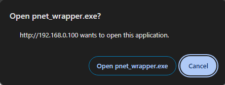

# PNETLab Protocol Handler
Conecta PNET con los protocolos _vnc_, _capture_ y _telnet_ para ser manejados por programas personalizados.

<br>

Los archivos .reg registran y asocian keywords a protocolos para ejecutar cierto programa cuando son invocados por el explorador de windows (o cualquier otro navegador/app). Los archivos **capture.reg**, **vnc.reg** y **telnet.reg** registran cada uno el respectivo protocolo, y los tres asocian la ejecución de **pnet_wrapper.exe**, dándole como argumento el respectivo URL generado por PNET Lab para ser parsado y redirigido a la app correspondiente con el formato respectivo.


<br>

Para la captura de wireshark, no es tan simple. Como realmente no es una captura directa si no una vía ssh, pasar argumentos no es suficiente. En resumen, se debe crear inicialmente un perfil el cual incluye configuración inicial para el módulo ssh-dump. Este perfil contiene credenciales de ssh, el host y la interfaz virtual a capturar (dentro de la VM). Luego, ya se puede lanzar wireshark especificando que se debe utilizar ssh-dump.exe y el host dado.


### Prerequisitos
- [OpenSSH](https://learn.microsoft.com/en-us/windows-server/administration/openssh/openssh_install_firstuse?tabs=gui#install-openssh-for-windows) (para ejecutar ssh-keygen para iniciar sesión vía wireshark. Solo el cliente es necesario, disponible vía features de Windows)
- [Wireshark](https://www.wireshark.org/download.html) (para capturar tráfico de red)
- [Xshell](https://www.netsarang.com/en/free-for-home-school/) (para sesiones telnet/ssh, versión educación gratis)
- [UltraVNC](https://uvnc.com/downloads/ultravnc.html) (para vnc en máquinas linux)


### Instalación

**Solamente si NO** están creadas, crea un par de llaves ssh en la ubicación default (**%USERPROFILE%\\.ssh**). Si tiene o deseas agregarle un passphrase, antes del paso 3 debes editar SSH\preferences. Descomentar linea 477 y colocarl el passphrase aca. (No he probado si al no especificarlo wireshark la solicita o no). <br><br>

Si no deseas un passphrase no es necesario editar este archivo.

     # opción 1: ed25519
     ssh-keygen -t ed25519

     # opción 2: RSA 4096
     ssh-keygen -t rsa -b 4096
    
1. Copia el contenido de la llave publica (**.ssh\id_rsa.pub** o **.ssh\id_ed25519.pub**) a *./.ssh/authorized_keys* dentro de la VM de PNET

```
echo "<public key>" >> $HOME/.ssh/authorized_keys
```

2. Registra cada uno de los _protocol handlers_ respectivos en windows registry(**regedit**). Puedes hacer doble click en cada uno para agregarlo al registro.  **SIEMPRE LEE CADA ARCHIVO .reg DESCARGADO DE INTERNET ANTES DE AGREGARLO A TU PC, PUEDE CONTENER CODIGO MALICIOSO**  

3. Copia el folder **SSH** en **%appdata%\Wireshark\profiles** (no solamente el contenido, si no toda la carpeta SSH)
   
4. Copia el folder **pnet-wrapper** en **C:\\Program Files\\** (Si quieres otra ubicación, debes modificar los archivos .reg para apuntar a esa dirección)

## Asegúrate de deshabilitar la consola html cuando estes en el navegador de PNET. Ahora seleccionar items activará las apps correspondientes.


## Extras

Para mejorar aún mas la experiencia, se puede remover el mensaje de "Estas seguro que deseas ejecutar esta aplicacion?".



La guía para esto se encuentra por separado en [Config-popup.md](Config-popup.md) ya que es un poco extenso. La opción de "recordar mi selección" está disponible solo para sitios HTTPs. Por lo que configurar esta comodidad involucra crear un certificado auto firmado, instalarlo en Windows, y habilitar esta opción oculta de Google chrome (probado en Version 120.0.6099.216). Para otros navegadores esto puede variar un poco y puede no ser necesario, hacer pruebas previamente.
